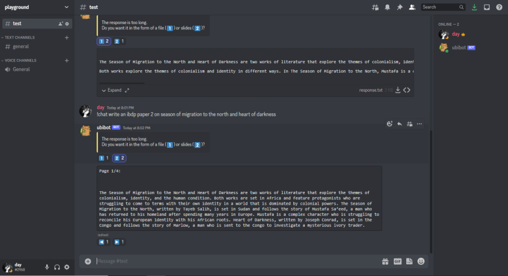

# Chat-GPT Discord Bot
A discord bot that uses `discord.py` and the `OpenAI API` to integrate Chat-GPT into your server.

### Usage
- `!help`
- `!chat` `[Your message]`
- React to the "Response is too long" warning to recieve the answer in a file or as slides

### Set up
Step 1: Install dependencies
```bash
pip install -r requirements.txt
```

Step 2: Set up environment valiables (the bot token and openai key) in .env
```bash
TOKEN = "[Your token]"
OPENAI_KEY = "[Your Key]"
```

Step 3: Run
```bash
py src/main.py
```

### Demo
